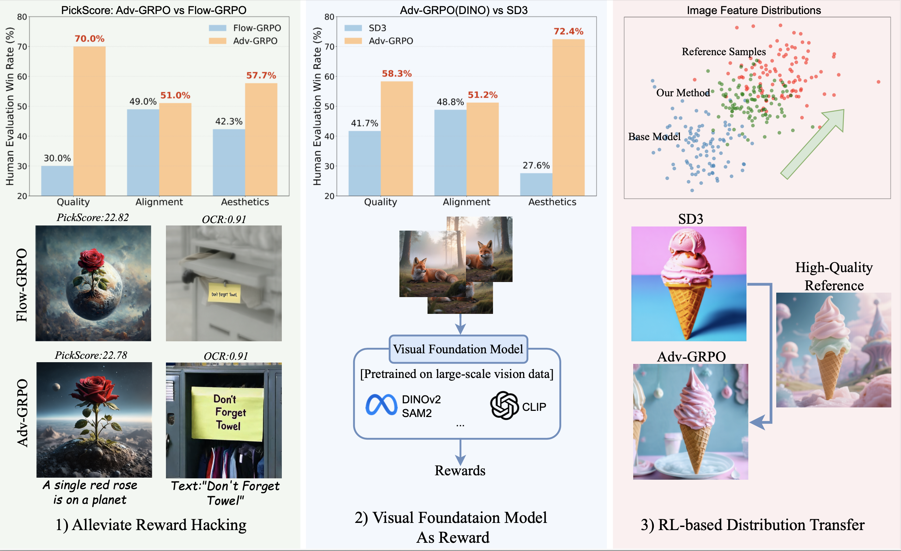

<h1 align="center"> The Image as Its Own Reward: <br>
Reinforcement Learning with Adversarial Reward for Image Generation


 </h1>

<div align="center" style="font-size:14px; line-height:1.4; margin-top:10px;">

[Weijia Mao](https://scholar.google.com/citations?user=S7bGBmkyNtEC&hl=zh-CN)<sup>1</sup> 
[Hao Chen](https://haochen-rye.github.io/)<sup>2</sup><sup>✉</sup> 
[Zhenheng Yang](https://zhenheny.github.io/)<sup>2</sup> 
[Mike Zheng Shou](https://sites.google.com/view/showlab/home?authuser=0)<sup>1</sup><sup>✉</sup>  


<sup>1</sup> Show Lab, National University of Singapore,  <sup>2</sup> ByteDance  

</div>
 
<div align="center">
  <a href='https://arxiv.org/abs/2511.20256'></a>  &nbsp;
  <a href='https://showlab.github.io/Adv-GRPO/'></a> &nbsp;
  <a href=""></a> &nbsp; 
  <a href='https://huggingface.co/benzweijia/Adv-GRPO'></a> &nbsp; 
  <a href='https://showlab.github.io/Adv-GRPO/assets/Adv-GRPO.pdf'></a> &nbsp;
  <a href='https://huggingface.co/spaces/benzweijia/Adv-GRPO'>
    
  </a> &nbsp;

</div>


## Adv-GRPO

<p align="center">
  
</p>

We introduce **Adv-GRPO**, an RL framework with an adversarial reward that iteratively updates
both the reward model and the generator. Our method Adv-GRPO improves text-to-image (T2I) generation in three ways:

 1) Alleviate Reward Hacking, achieving higher perceptual quality while maintaining comparable benchmark performance
(e.g., PickScore, OCR), as shown in the top-left human evaluation panel;

 2) Visual Foundation Model as Reward,
leveraging visual foundation models (e.g., DINO) for rich visual priors, leading to overall improvements as shown
in middle-top human evaluation results; 

 3) RL-based Distribution Transfer, enabling style customization by aligning
generations with reference domains

## Changelog


**2025-11-27**

* We also released our reference datasets. 
  - [QWen_Image_PickScore](https://huggingface.co/datasets/benzweijia/QWen_Image_PickScore/resolve/main/images.tar?download=true)

* The Adv-GRPO demo is now available on Hugging Face: 
  - [PickScore](https://huggingface.co/spaces/benzweijia/Adv-GRPO)
  - [DINOv2](https://huggingface.co/spaces/benzweijia/Adv-GRPO_DINO)

**2025-11-25**

* We release the code of Adv-GRPO training code, inference code and the pretrained ckpt.

<!-- 
## FAQ -->

## 📝 TO DO
- [ ] Release the reference dataset used in our work  
- [ ] Release the DINO reward checkpoint trained with GenEval and OCR prompts  
- [ ] Release the style transfer checkpoint  
- [ ] Try more base models like QWen-Image

## 🤗 Model
| Task    | Model |
| -------- | -------- |
| PickScore     | [🤗PickScore](https://huggingface.co/benzweijia/Adv-GRPO/tree/main/PickScore) |
| DINOv2     | [🤗DINOv2](https://huggingface.co/benzweijia/Adv-GRPO/tree/main/DINO) |


## 🚀 Quick Started
### 1. Environment Set Up

Clone this repository and install packages.

```bash
git clone https://github.com/showlab/Adv-GRPO.git
cd Adv-GRPO
conda create -n adv_grpo python=3.10.16 -y
pip install -e .
```

### 2. Reference Image Generation

We use the Qwen-Image model (https://github.com/QwenLM/Qwen-Image) to generate reference images.

First, install the dependencies required by Qwen-Image.

```bash

python reference_imgs_scripts/qwen_generate_multi.py \
    --node_rank 0 \
    --num_nodes 1 \
    --num_variations 8 \
    --output_dir "" \
    --text_file ""
```

The reference images will be saved in output_dir and the json file will be like this:

```json
{
  "middle-aged man with a beard giving a thumbs up, upper body, green fields in the background": [
    "node0_rank3_00000_0.png",
    "node0_rank3_00000_1.png",
    ...
  ],
  "king charles spaniel with planets for eyes, ethereal, midjourney style lighting and shadows, insanely detailed, 8k, photorealistic": [
    "node0_rank3_00001_0.png",
    "node0_rank3_00001_1.png",
    ...
  ],
  ...

}
```


And if you do not want to generate, you can use our generated images: [🤗QWen_PickScore](https://huggingface.co/datasets/benzweijia/QWen_Image_PickScore/resolve/main/images.tar?download=true)


<!-- [🤗Reference Dataset](https://huggingface.co/datasets/benzweijia/QWen_Image_PickScore) | -->


Some tips:

- Our reference dataset is relatively large — the full set is about 60 GB if you choose to download it.

- Actually, we do not use all images during training. Similarly, not all prompts are covered when using DINOv2.

- Based on our ablation studies, using a smaller subset of reference images and prompts can still achieve comparable performance to using the full dataset when observing the DINO similarity.

- If you prefer not to use our dataset or have a better alternative, you can use your own dataset and simply adapt it to the required format.


### 2. Inferece Stage.

Firstly, we set the config file  .config/grpo.py

``` python
def eval_sd3_fast():
    ...
     config.train.lora_path = ""
    config.save_folder = ""
    config.json_path = ""
    config.reference_image_path = ""
    config.test_reference_image_path = ""
    ...

```

- `lora_path`: LoRA checkpoint path  
- `save_folder`: Output directory  
- `json_path`: JSON metadata file where each key is a prompt and each value is a list containing the file paths of the corresponding reference images.
- `reference_image_path`: Reference images for inference (optional)  
- `test_reference_image_path`: Test-time reference images (optional)


Secondly, 

```bash
bash scripts/multi_node/sd3_fast/eval.sh 


```
You can modify the value after --prompts to try any text prompt you like.


If you want to generate one image,

```bash
python3 inference_t2i.py --config config/grpo.py:eval_sd3_fast --prompts "a flower on a planet"
```
You can modify the value after --prompts to try any text prompt you like.

### 4. Start Training

The config file is in the .config/grpo.py


``` python
def dino_cotrain_sd3_patch_fast():
    ...
    config.json_path = ""
    config.refernce_image_path = ""
    config.test_reference_image_path = ""
    ...
```

We use deepspeed stage2 to save the memory.

```bash
# zero2
accelerate launch --config_file scripts/accelerate_configs/deepspeed_zero2.yaml
# zero3
accelerate launch --config_file scripts/accelerate_configs/deepspeed_zero3.yaml
```

#### GRPO
Single-node training:
```bash
# sd3 grpo with DINO reward
bash scripts/grpo_dino.sh
```


```bash
# sd3 grpo with PickScore reward
bash scripts/grpo_pickscore.sh

```


        
## ✨ Important Tips
1. You can adjust the parameters in `config/grpo.py` to tune different hyperparameters. 


## 🤗 Acknowledgement
This repo is based on [Flow-GRPO](https://github.com/yifan123/flow_grpo.git) . We thank the authors for their valuable contributions to the AIGC community.

## ⭐Citation
If you find Adv-GRPO useful for your research or projects, we would greatly appreciate it if you could cite the following paper:

```
@article{mao2025image,
  title={The Image as Its Own Reward: Reinforcement Learning with Adversarial Reward for Image Generation},
  author={Mao, Weijia and Chen, Hao and Yang, Zhenheng and Shou, Mike Zheng},
  journal={arXiv preprint arXiv:2511.20256},
  year={2025}
}


```